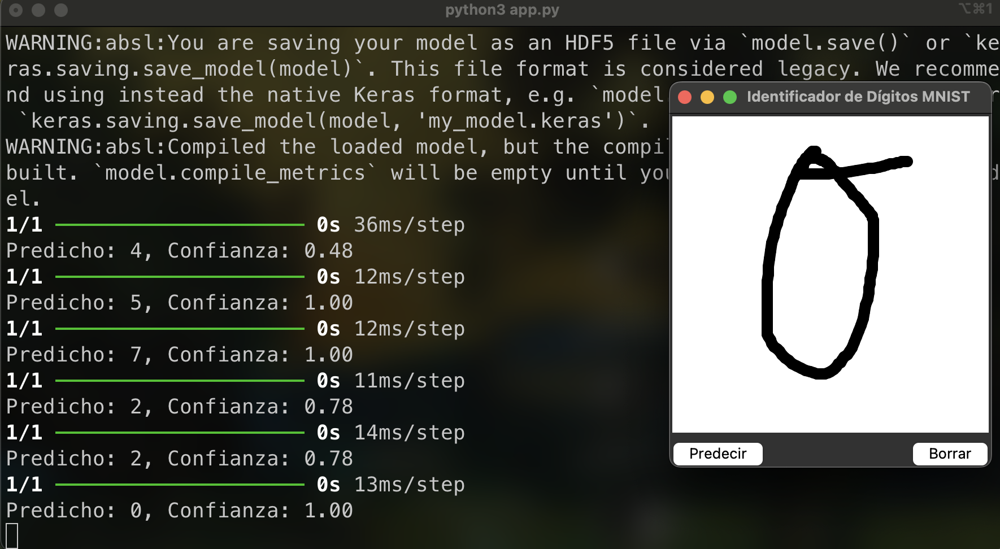
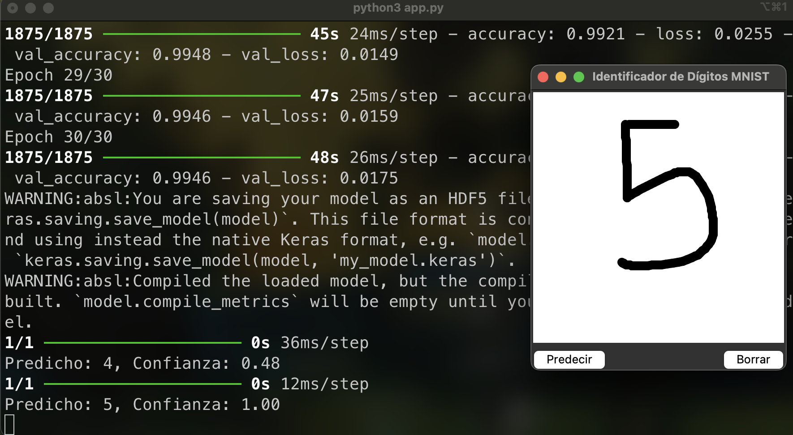

# 🖌️ Handwritten Digit Recognition with MNIST

This project implements a graphical interface that allows users to draw digits, which are then identified using a machine learning model trained on the MNIST dataset. It combines computer vision and deep learning to create an interactive and intuitive experience for digit recognition.

---

## 🚀 Features

- **Interactive GUI**: Draw digits on a canvas using the Tkinter-based interface.
- **Real-Time Recognition**: Predict the drawn digit instantly with high accuracy.
- **Deep Learning Integration**: Uses a Convolutional Neural Network (CNN) trained on the MNIST dataset.
- **Simple and Efficient**: Lightweight application with minimal setup requirements.

---

## 🛠️ Technologies Used

- **Programming Language**: Python
- **Libraries**: 
  - Tkinter (GUI)
  - TensorFlow/Keras (Model Training & Prediction)
  - NumPy (Data Manipulation)
- **Dataset**: MNIST Handwritten Digits Dataset

---

## 📂 How It Works

1. **Drawing Canvas**: Users can draw a digit on the provided canvas.
2. **Preprocessing**: The drawn image is resized and converted to grayscale.
3. **Prediction**: The preprocessed image is passed to the trained CNN model.
4. **Output Display**: The predicted digit is displayed alongside the drawing.

---

## 🔧 Setup Instructions
- **Clone the Repository**:
   ```bash
   git clone <https://github.com/mggmz/Computer-Vision-Image-Processing-ML.git>
   cd <Computer-Vision-Image-Processing-ML>

## Screenshots 




## 📜 License

This project is licensed under no License


## 📝 Acknowledgements

- ** MNIST Dataset by Yann LeCun and colleagues.